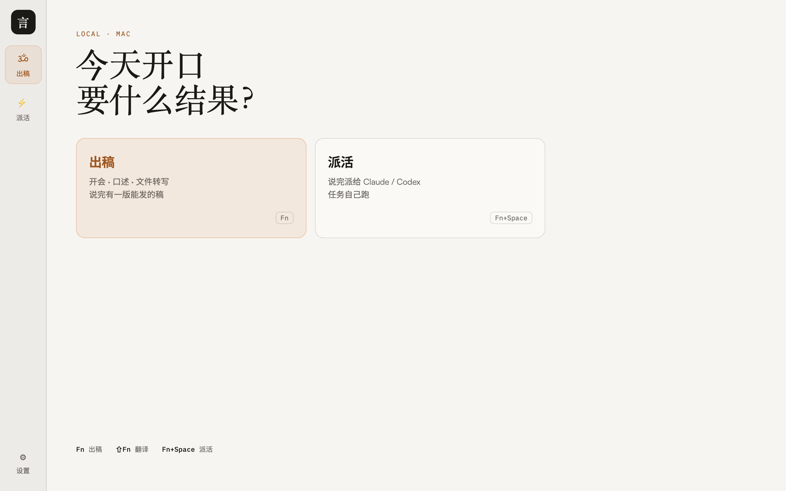
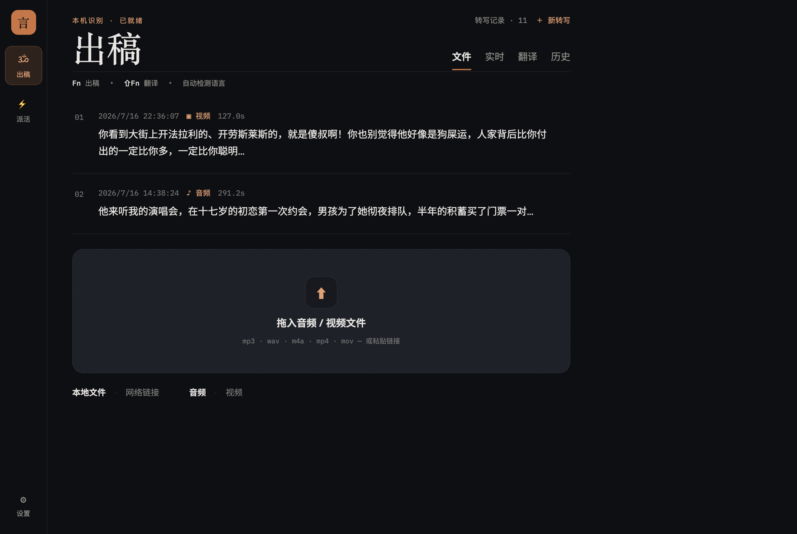
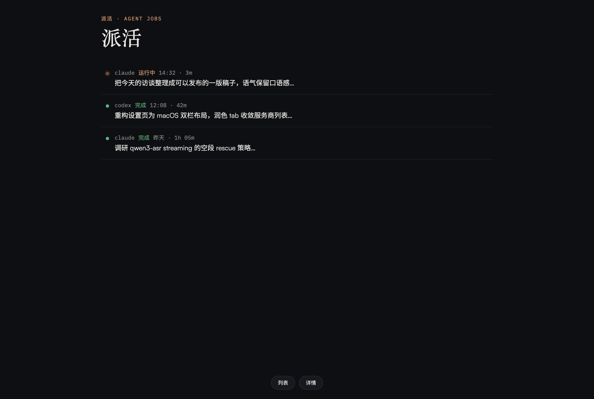
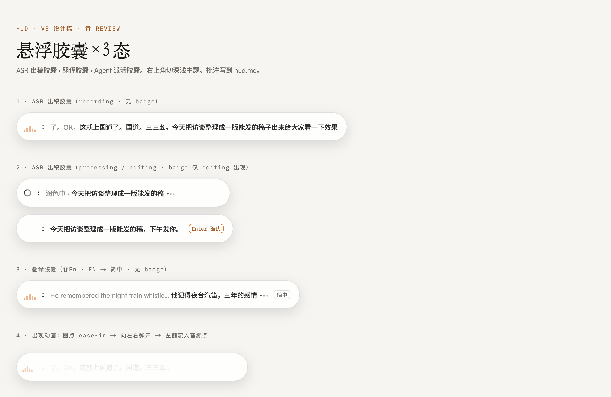
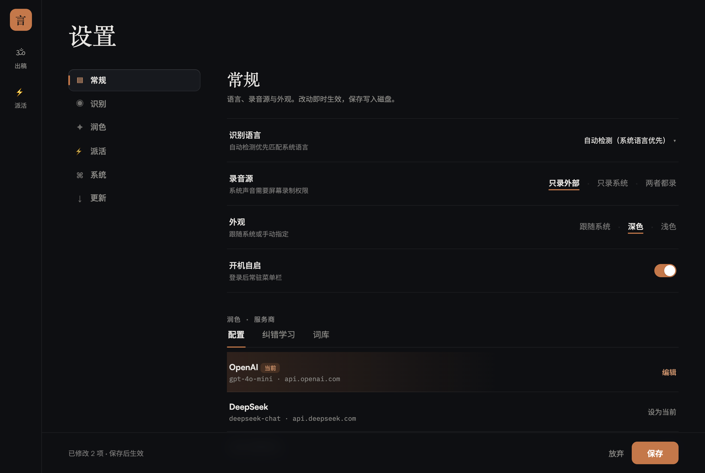

# Yanluo（言落）

[](https://github.com/Sherlockouo/yanluo/actions/workflows/ci.yml)
[](https://github.com/Sherlockouo/yanluo/releases/latest)

**你的声音留在本机。开口出稿，开口派活。**

macOS 桌面应用：开会 / 口述 / 文件转写成稿，或把活派给 Claude / Codex / Pi。声音和文字默认不离开这台电脑。

[下载最新版](https://github.com/Sherlockouo/yanluo/releases) · [更新日志](./CHANGELOG.md)

macOS：若提示「已损坏」，把 Yanluo 拖进「应用程序」后，双击 DMG 里的 **若打不开-点我.command**。

---

## 使用态

<p align="center">
  
</p>

<p align="center"><sub>首页 — 今天开口要什么结果</sub></p>

<p align="center">
  
</p>

<p align="center"><sub>出稿 — 文件 / 实时 / 翻译 / 历史</sub></p>

<p align="center">
  
</p>

<p align="center"><sub>派活 — 任务跑在本机 Agent</sub></p>

<p align="center">
  
</p>

<p align="center"><sub>HUD — Fn 出稿 · ⇧Fn 翻译 · Fn+Space 派活</sub></p>

<p align="center">
  
</p>

<p align="center"><sub>设置 — 引擎 / 权限 / 更新</sub></p>

---

## 能做什么

| | |
|---|---|
| **出稿** | 边说边出字；拖文件转写；⇧Fn 翻译；历史回看 |
| **派活** | Fn+Space 召唤 Agent，活自己跑 |
| **本机** | 默认不上云；Apple Silicon 可走本地 Qwen/MLX |
| **热键** | `Fn` 出稿 · `⇧Fn` 翻译 · `Fn+Space` 派活 |

对用户别提 MLX / 流式切段 / 本地推理——那是引擎细节。

---

## 开发

栈：**Tauri 2 · React 19 · Tailwind · Rust**（ASR：[qwen3_asr_rs](https://github.com/XBCoder128/qwen3_asr_rs) + MLX）。

```bash
# 依赖
# macOS / Apple Silicon: Xcode + cmake；本地 Qwen = MLX
xcode-select --install
brew install cmake

# Linux / Windows: 本地 Qwen = libtorch（见 doc/BUILD.md）
# node scripts/fetch-libtorch.mjs          # CPU
# node scripts/fetch-libtorch.mjs --cuda   # NVIDIA CUDA 12.6
# export LIBTORCH=$PWD/src-tauri/libtorch
# export LIBTORCH_BYPASS_VERSION_CHECK=1

pnpm install
pnpm tauri:dev:local     # 带本地 Qwen（首次编译较久）
pnpm tauri dev           # 不带本地 Qwen（仅系统识别等）
```

应用内点「下载模型」会一次拉齐权重 + `tokenizer.json`，下完自动写入目录并加载。发布包（macOS ARM / Linux / Windows）均带 `qwen-local`。Linux Release 打 CUDA libtorch（有 NVIDIA 驱动即可 GPU，否则回退 CPU）；Windows Release 当前为 CPU libtorch（本机可用 `--cuda` 自编）。

更新 ASR 引擎依赖：

```bash
cd src-tauri && cargo update -p qwen3-asr-rs
```

### 文档入口

| 文档 | 用途 |
|------|------|
| [`doc/README.md`](./doc/README.md) | **技术文档索引** |
| [`doc/DESIGN.md`](./doc/DESIGN.md) | 品牌 / IA / 动效 |
| [`doc/RELEASE.md`](./doc/RELEASE.md) | 发版 checklist（版本同步 · tag · CI） |
| [`doc/BUILD.md`](./doc/BUILD.md) | 编译踩坑（Metal / mlx-c / cmake） |

---

## License

Apache-2.0

Qwen3-ASR 模型权重另有许可，商用前自行确认。
